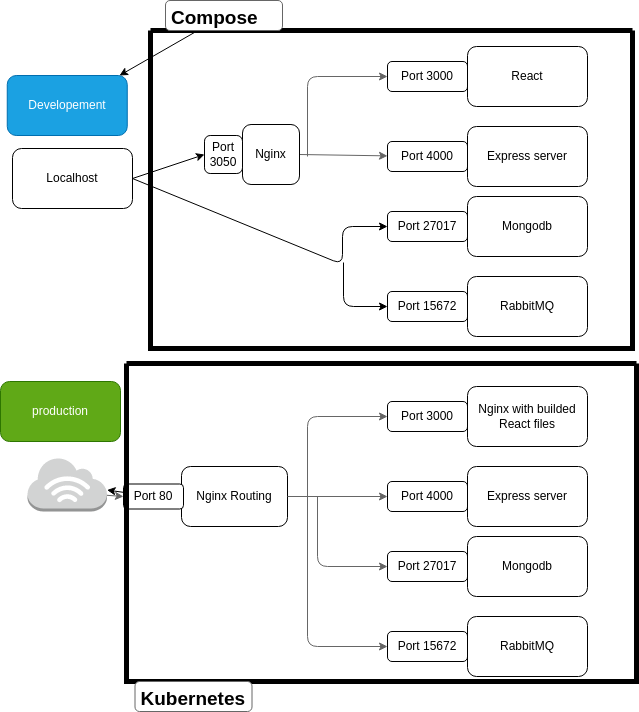
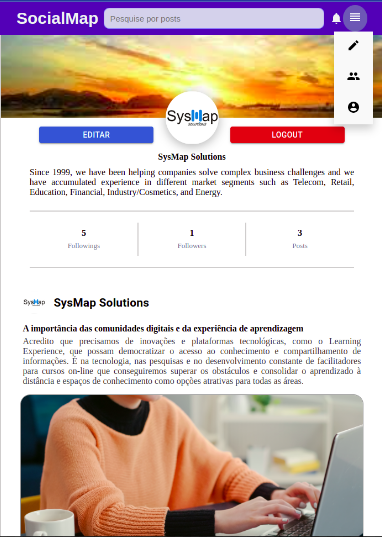
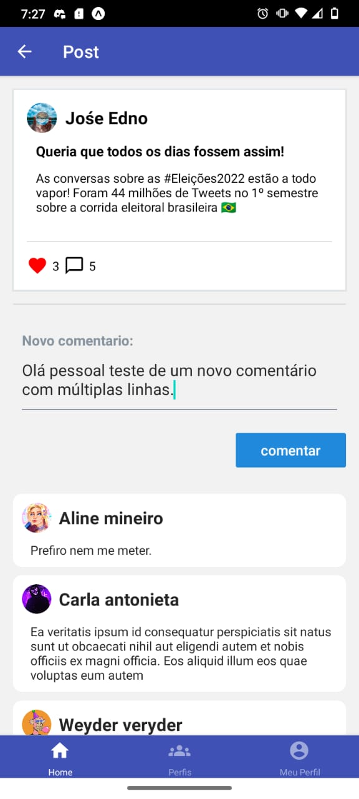
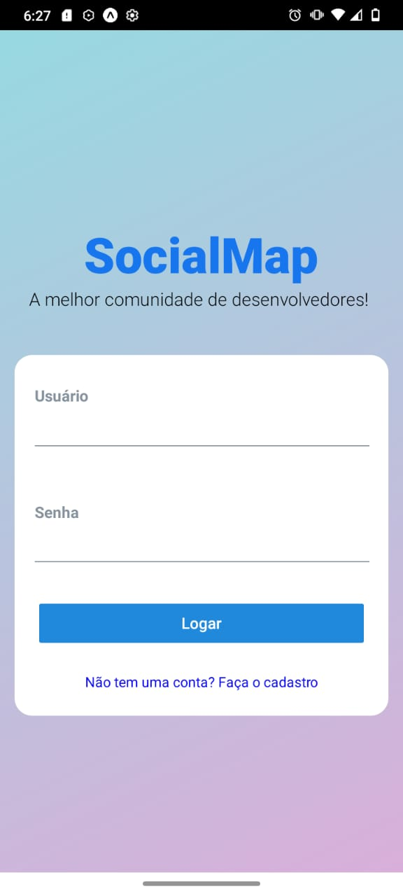
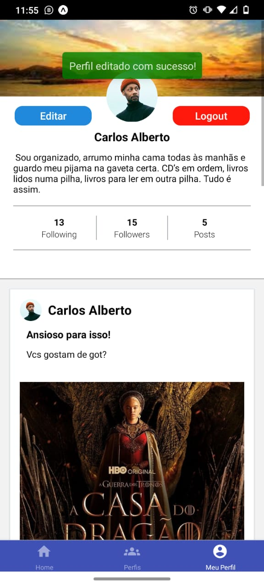

<h1 align="center">
  
</h1>

- [x] Settings Kubernets (Desenvolvendo)
- [x] API Backend
- [x] Frontend Web
- [x] Frontend Mobile

## Arquitetura



## Versão WEB (100% responsiva)

<p align="center">
  <kbd>
    
  </kbd>
  <kbd>
    
  </kbd>
  <kbd>
    
  </kbd>
    &nbsp;&nbsp;&nbsp;&nbsp;

</p>
<p align="center">
<kbd>
  
</kbd>
</p>

## Versão Mobile
<p align="center">
  <kbd>
    
  </kbd>
  <kbd>
    
  </kbd>
  <kbd>
    
  </kbd>
    &nbsp;&nbsp;&nbsp;&nbsp;

</p>


# Rodar o projeto

### Clone o repositorio
```shell
$ git clone https://github.com/bc-fullstack-01/EdnoAlmeida-ProjetoFinal.git
$ cd EdnoAlmeida-ProjetoFinal
```
## Iniciando o back e o front juntos
<br>

```shell
$ docker-compose up
```
- Para popular o banco de dados para fins de teste faça um get na rota a baixo, simplesmente colando esse endereço no navegador. Com o backend rodando é claro.
```sh
http://localhost:4000/v1/dev/seed
```
## - Iniciando os projetos separadamente
<br>

## Iniciar o Backend

```shell
$ cd SocialMap-Backend
```
- No arquivo .env, mude o valor da variável HOTS para o host da sua rede

```js
HOST=SUA_REDE
```
### Inicie o container do Backend
* OBS: Cuidado com os possíveis erros causados por nomes genéricos nos containers como 'mongodb'. Você pode precisar renomeá-los.
```shell
$ docker-compose build
$ docker-compose up
```

- No arquivo app.js pode ser necessário comentar a linha que invoca o middlware helmet.
```js
// Middlewares
app.use(cors())
//app.use(helmet());
```

## Inicie o projeto Frontend
```shell
$ cd SocialMap-Frontend
$ npm install
```
* OBS: O projeto React usa a porta 3000 que é bem comum, caso haja algum programa rodando nessa porta você deve alterar uma das duas.

```shell
$ npm start
```

## Inicie o projeto Mobile
```shell
$ cd SocialMap-Mobile
$ npm install
```

### Mudar o valor no arquivo constante.ts para o host da sua internet  
### Optei por fazer isso para poder acessar o backend pelo celular usando a mesma rede
```js
const CONSTANTS = {
    API_HOST: 'http://SUA_REDE:4000/v1',
    SOCKET_HOST: 'http://SUA_REDE:4000/v1'
}
```
### Rodar o projeto
```shell
$ npm start
```
