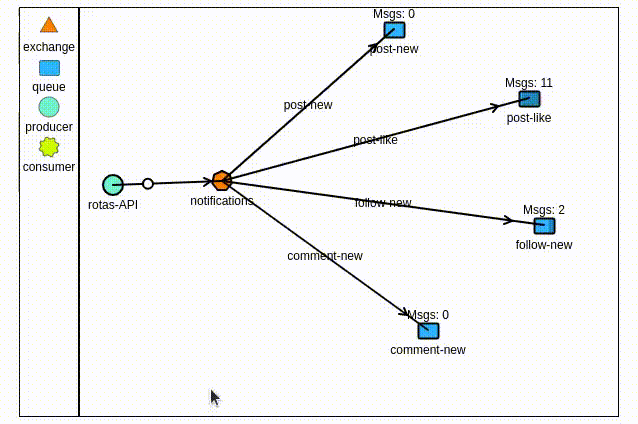

SocialMap API
=========

## Feactures
<ul>
<li>Autentificação com JWT e encriptografia de senha</li>
<li>Helmet - para proteção</li>
<li>Swagger - Criação da documentação</li>
<li>Morgan - Criação de Logs para cada iniciação do server</li>
<li>Websocket - Para alerta de notficações</li>
<li>RabbitMQ - Exchange para Notificações</li>
</ul>

# Mensageria
- Exchange do tipo 'direct' pra notificações
- Filas para cada tipo de notificação tratada
- A seguir um esquema do funcionamento:
<p align="center">

</p>

# Requisitos
- Adicionar usuário do Sysmap com a descrição da empresa no inicio do feed

# Principais Personalizações

- Checagem do estado do container rabbitmq para iniciar o dependentes.
```sh
    healthcheck:
      test: [ "CMD", "nc", "-z", "http://localhost:15672" ]
      interval: 10s
      timeout: 5s
      retries: 5
```
- População robusta do banco de dados, atravéz do seed

- Post com midia e texto
- Usando a lib ampqlib para rabbitMQ
- Criando exchange e filas na inicialização do server
- Usando o addToSet em vez do push para evitar duplicação de likes ou seguidores
```
{ $addToSet: { following: id_two }
```
- Populando apenas os campos desejados para economizar no tráfego de dados
```
.populate('profile', ['name', 'midia'])
.populate({ path: 'comments', populate: { path: 'profile', select: ['name' 'midia'] } })
```


        
# 🎲 Para Rodar o Back End

```shell
$ cd SocialMap-Backend
```

- No arquivo .env, mude o valor da variável HOTS para o host da sua rede

```js
HOST=SUA_REDE
```


### Inicie o container do Backend
* OBS: Cuidado com os possíveis erros causados por nomes genéricos nos containers como 'mongodb'. Você pode precisar renomeá-los.
```shell
$ docker-compose build
$ docker-compose up
```

- No arquivo app.js pode ser necessário comentar a linha que invoca o middlware helmet.
```js
// Middlewares
app.use(cors())
//app.use(helmet());
```

- Para popular o banco de dados para fins de teste faça um get na rota a baixo, simplesmente colando esse endereço no navegador. Com o backend rodando é claro.
```sh
http://SUA_REDE:4000/v1/dev/seed
```
